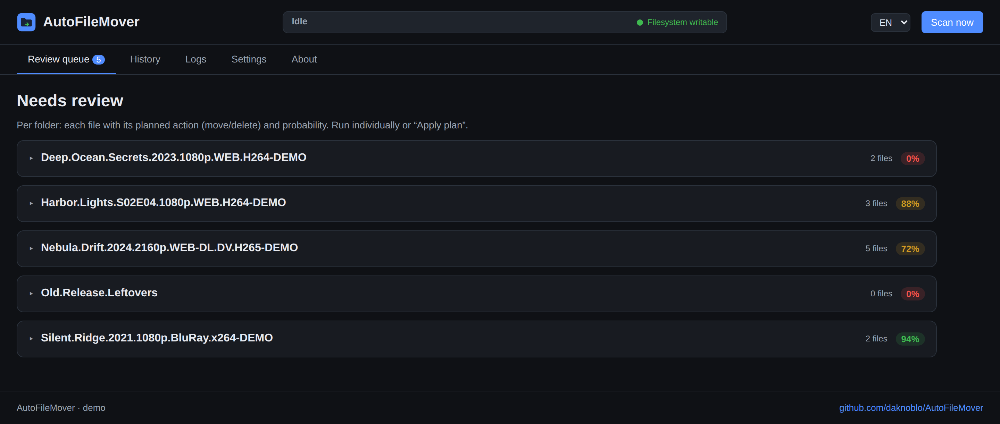
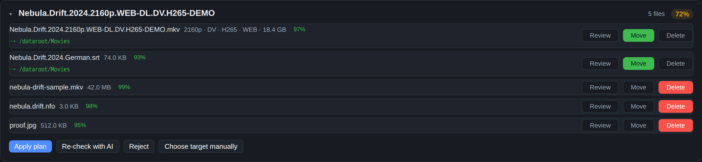
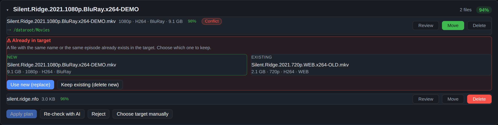
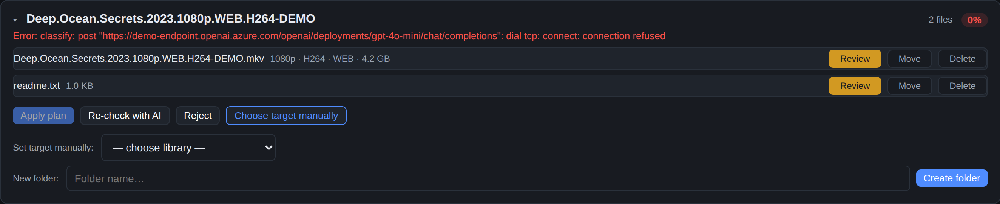
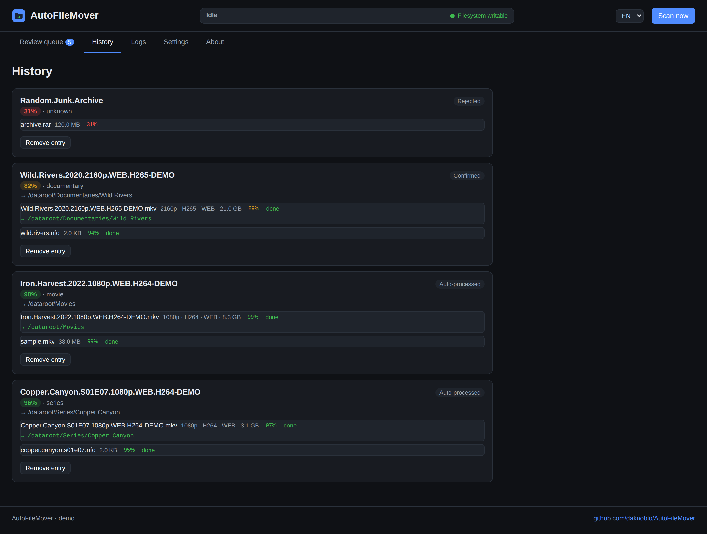
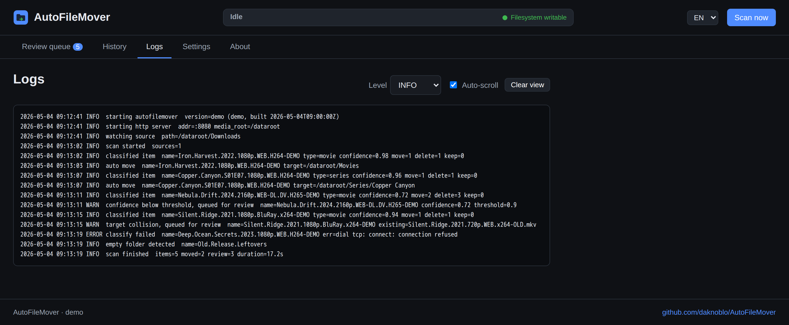
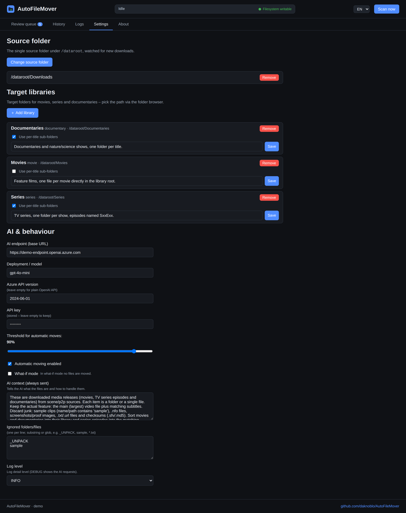
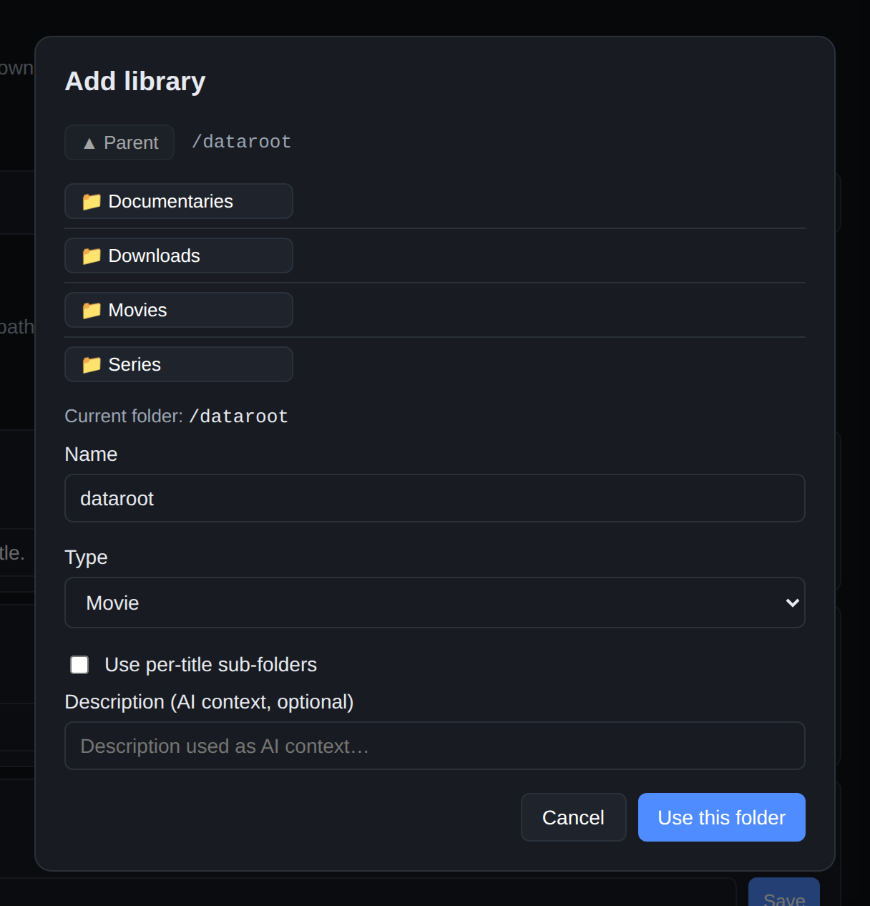
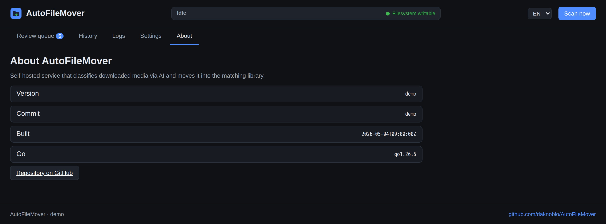

# Demo

<!-- Generated by tools/screenshots/capture.mjs — do not edit by hand. -->

AutoFileMover ships a bilingual web UI (German/English). The screenshots below
are generated automatically from a demo instance filled with sample data, so
they always show the current interface.

Run the same instance locally with `make demo` and open <http://127.0.0.1:8099>.

## Review queue

Everything the AI could not resolve on its own: one card per download folder with the detected confidence and the number of files. Cards are collapsed until you open them.

## Per-file decisions

Each file is judged individually: the main feature and its subtitles are moved, sample clips, NFO files and proof images are deleted. The destination folder is shown below every file that will be moved, and each action can be overridden before the plan is applied.

## Collision with an existing file

If the target already holds the same file or the same episode, the move is held back. A side-by-side comparison shows size and the release attributes parsed from the file name, so you can replace the old copy or drop the new one.

## Manual target & new folders

When the AI endpoint fails or no target resolves, the item stays in the queue with its error. “Choose target manually” reveals the library picker, an existing sub-folder can be selected or a new one created right there.

## History

Automatically moved, confirmed and rejected items with their target path and the files that were processed.

## Logs

The structured log of the running service, filtered by level. DEBUG additionally shows the full AI requests and responses.

## Settings

Source folder, target libraries with their per-title sub-folder switch and AI context, the AI endpoint, the confidence threshold, what-if mode and the ignore list — all stored in the database, no config file needed.

## Folder browser

Source folders and libraries are picked by browsing the mounted media root, so no path can be mistyped. Every folder can carry a description that is sent to the AI as extra context.

## About

Version, commit, build date and Go version of the running build.

